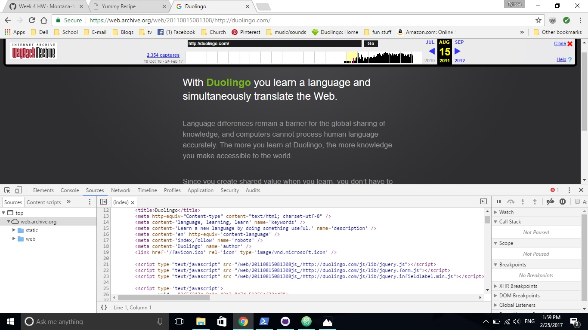

<h2>Week 4</h2>
<h4> Tylissa Gordon</h4>
<h6>Nick Moles - Section 50</h6>

<h6>Week 4 homework</h6>

How do I do this again? Oh yea... that's how you do it.

 

When I looked at what I needed to do for homework I couldn't remember how to create an index.html nor could I remember the different semantic markup elements. I was a week ahead last week so I decided to not worry about keeping ahead and use that extra time to study for another class. I looked at some of the homework submissions that were already up and took a look at my week 3 homework.

After looking at those examples and getting started on the week 4 homework I remembered what I was doing and was able to complete the homework within an hour or two.

What I took away from this week is how many different ways there are to convey emotion, importance, and actual conversation in a website. It's really cool to be able to understand what all the markdown is and to be able to creat a website. I always get really excited when I look at the website that I have created through this class because it's my own website that I made!

<h6> Step-by-Step</h6>
<ol>
  <li>Looked at homework examples</li>
    <ul>
      <li>I'm a visual person so it's easier for me to look/follow examples</li>
    </ul>
  <li>Decided to use a real recipe that I have used and pulled it up</li>
  <li>Worked on week 4 homework.</li> <li>Took a break to eat breakfast.</li>
  <li>Continued to work on week 4 homework until I had it completed and looking the way that I wanted it to.</li>

<h6>The WyBack Machine</h6>

That's what that site looked like!?!

 

As with many people taking this class and as with everyone in their 20s I grew up with technology and using the internet. It was interesting to see what some of the websites I use today looked like when they first got started.

For a website that started before 200 I decided to look at Google since that was the only site I could think of that had been around that long. For my second site I decided to look at Duolingo.

I don't feel that Google changed much through the years. Their first page looked similar to my first webpage, white back ground with black writting and maybe a link to another page. As time went on they figured out how to make their page look more interesting with color, pictures, and graphics. Other then that I thought that the only things that changed were the placement of links.

Duolingo on the other hand changed quite a bit.

Duolingo's first page was simply a page stating that Duolingo was a new way to learn languages but was not up yet. They had a link to follow them on twitter however.

A little later on their site had a gray background with a little explanation of what their site is about.

Looking at the markdown for this page it doesn't seem like too much just fairly simple.

Looking at Duolingo.com today we can see a picture of the world with some of the different languages that the site offers. We can also clearly see a button to get started on our language learning adventure and a button to log in if you have already started an adventure.

Looking at the markdown for the current duolingo start page there is a lot of different things put together to create the page that we see.

I'm still trying to understand everything so my discussion on the evolution of the wepages probably wasn't what you were looking for but it was interesting to me to visually see what the websites looked like and how they changed over time.

