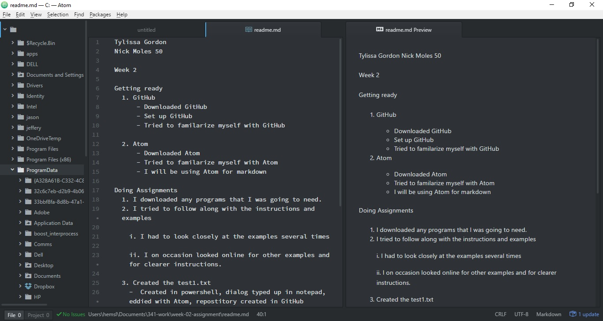

Tylissa Gordon
Nick Moles 50

Week 2

Getting ready
  1. GitHub
      - Downloaded GitHub
      - Set up GitHub
      - Tried to familarize myself with GitHub

  2. Atom
      - Downloaded Atom
      - Tried to familarize myself with Atom
      - I will be using Atom for markdown

Doing Assignments
  1. I downloaded any programs that I was going to need.
  2. I tried to follow along with the instructions and examples

    i. I had to look closely at the examples several times

    ii. I on occasion looked online for other examples and for clearer instructions.

  3. Created the test1.txt
    -  Created in powershell, dialog typed up in notepad, eddied with Atom, repostitory created in GitHub

        a. attempted to upload to github.com

        b. had trouble uploading repository to github.com ... tried for several days

        c. restarted computer as a desperate atempt to get the repository to upload

        d. restart worked uploaded repository

``` html ```

``` <I am trying my best> ```

``` <Am I doing this right> ```


